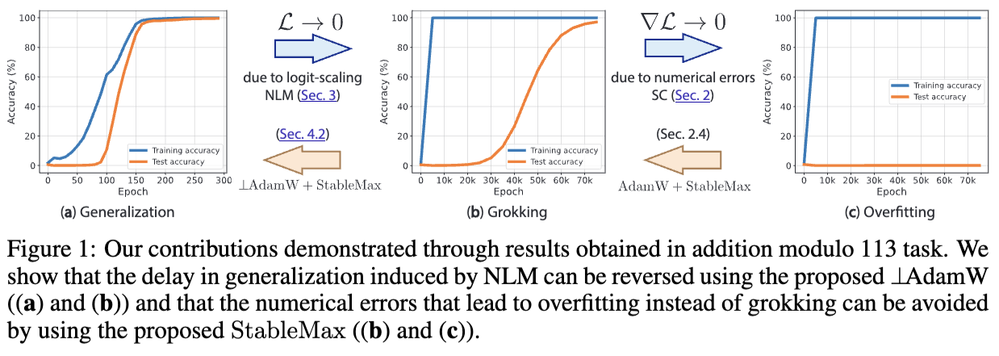

# Grokking Under Differential Privacy

<p align="center">
  
</p>

This repository is the official implementation for our research project: **"Grokking Under Differential Privacy."** This work is built upon the ICLR 2025 paper [**Grokking at the Edge of Numerical Stability**](https://arxiv.org/abs/2501.04697) by Prieto et al.

## 🔬 Research Overview

The original paper demonstrates that without regularization, models fail to grok because they enter a state of **Naïve Loss Minimization (NLM)**, leading to **Softmax Collapse (SC)**. 

Our project introduces **Differential Privacy (DP)** as a novel information constraint to test a critical theoretical trade-off:
1. **The Stabilizer (Cure):** Does DP's **Gradient Clipping** implicitly prevent the weight explosion that causes Softmax Collapse?
2. **The Delay (Cost):** Does the **Gaussian Noise** injected by DP-SGD destroy the faint gradient signal required for the phase transition to generalization?

## 🚀 Experimental Roadmap

We replace traditional weight decay ($\lambda$) with a privacy budget ($\epsilon$) sweep:
* **Baseline:** Replicating the "failure to grok" at $\lambda = 0$ (Softmax Collapse).
* **Intervention:** Implementing DP-SGD via the `Opacus` library.
* **Analysis:** A sweep over $\epsilon \in \{0.1, 0.5, 1.0, 5.0, 10.0\}$ to generate a **Phase Diagram** (Latency vs. Privacy).

## 🛠️ Setup & Installation

### 1. Environment Configuration
We recommend using Python 3.10 and Conda for isolation:

```bash
# Create and activate environment
conda create -n grokking-dp python=3.10 -y
conda activate grokking-dp

# Install PyTorch with CUDA 12.1 support
conda install pytorch torchvision torchaudio pytorch-cuda=12.1 -c pytorch -c nvidia
